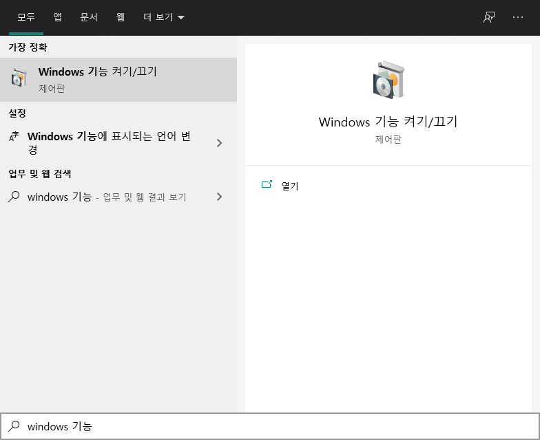
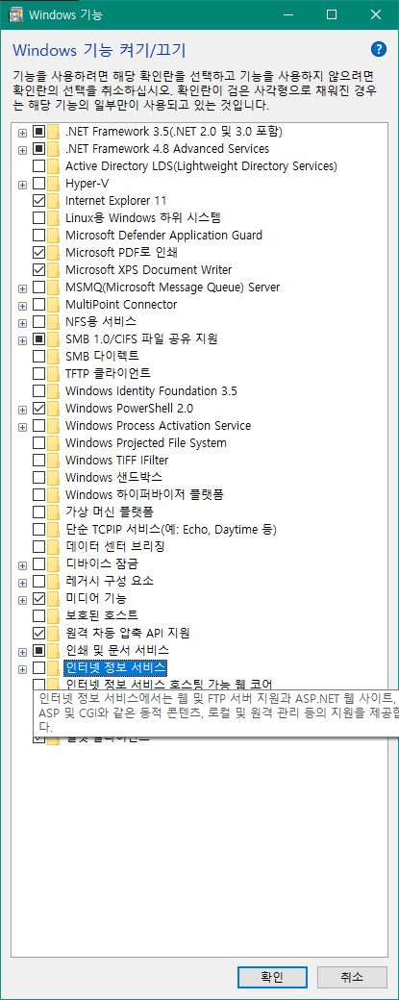
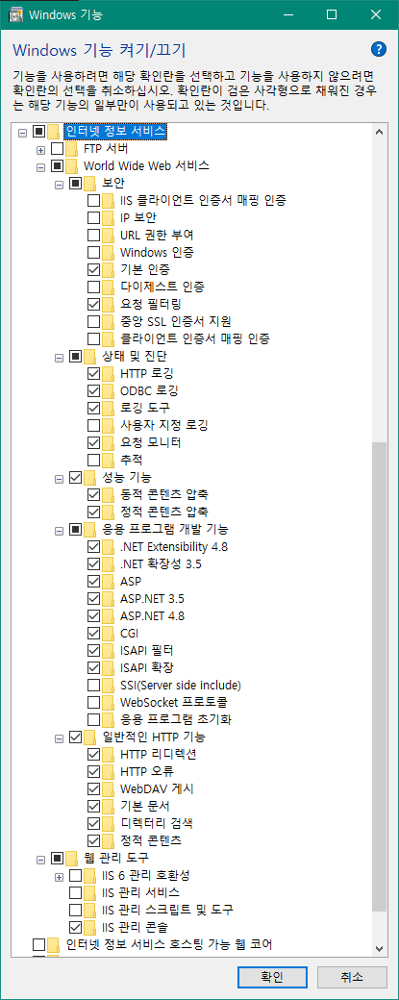
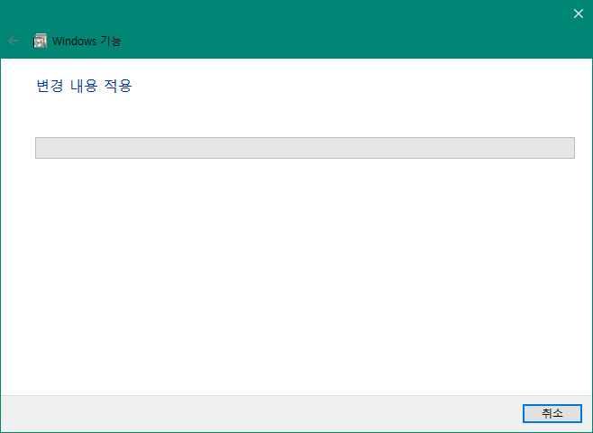
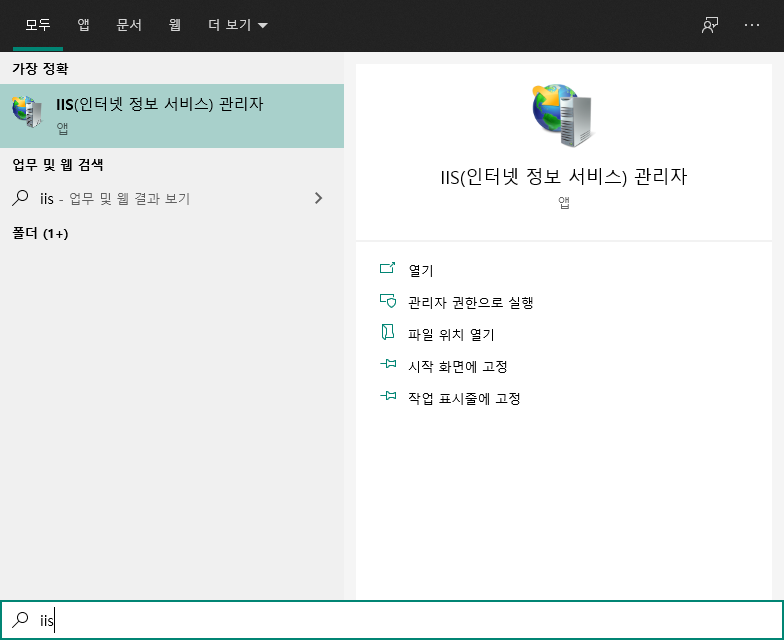

# 윈도우 10 IIS 및 클래식 ASP 설정

## IIS 란

IIS는 Internet Information Service의 약자로 MS에서 만든 윈도우 OS 상에서 동작하는 웹서버임.  
Windows에서 GUI 기반이라 설정도 편하고 Httpd에 비해서 기능이 많다고는 하는데, 사실 나는 Httpd가 더 편한 것 같음.  
  
### IIS 장점
  
- Windows OS 상에서 설치가 쉬움,
- GUI라서 편하다고 함(본인은 동의하지 않음)
- 플러그인을 쉽게 설치 관리가 가능하다고 함.
  
### IIS 단점
  
- Windows OS 상에서만 사용 가능,
- 구글링 시 정보의 질과 양이 Apache httpd보다 떨어짐.
- 윈도우 버젼에 따라, IIS 버젼에 따라 디테일하게 다른점이 있어서 검색 결과가 나랑 맞지 않은 경우가 많음.

## IIS 설치
  
1. **"Windows 기능 켜기/끄기"** 찾아 실행
  - 제어판 > 프로그램 추가 제거 > "Windows 기능 켜기/끄기" 로 실행할 수도 있지만,
  - 키보드 ctrl과 alt 사이에 있는 **"win"** 단축키를 열어 "Windows 기능 켜기/끄기"를 검색해서 실행할 수 있다
  - 
2. Windows 기능 켜기/끄기에서 **"인터넷 정보 서비스"**찾기
  - 
3. 다음 선택된 항목들 모두 체크하기
  - 
4. 활성화 완료 후 확인버튼 클릭시 설치가 시작 됨.
  - 
5. **"win"** 단축키를 열어 **"IIS"**를 검색하여 실행시킬 수 있다면 설치가 완료된 것 임.
  - 
6. IIS 실행
  - 
7. 브라우져 주소창에 localhost로 접근해서 IIS 정상 작동 확인
  - 
8. IIS에 설정된 사이트의 기본 경로는 **C:\inetpub\wwwroot**이다. 해당 경로의 폴더에 들어가면 다음과 같은 파일이 있음은 볼 수 있다
  - 
  - 
9. 테스트 웹 사이트이므로 포트 변경이 가능하지만 방화벽 설정이 귀찮으므로 나는 80포트를 그대로 사용하기로 했다.
  - 
10. ASP 동작 테스트를 하기 위해 8의 기본 경로 **C:\inetpub\wwwroot**아래에 **ex-01.asp**파일을 만들었다.
  - 
11. ASP 동작 테스트로 브라우져에서 **http://localhost/ex-01.asp**로 접속하였다.  
  역시나 한글이 깨지긴 하지만 다행히 ASP가 정상 작동 한다는 것을 알 수 있다.
  - 

---

# 참고

- 출처 : [https://tothenextlevel.tistory.com/56](https://tothenextlevel.tistory.com/56)  